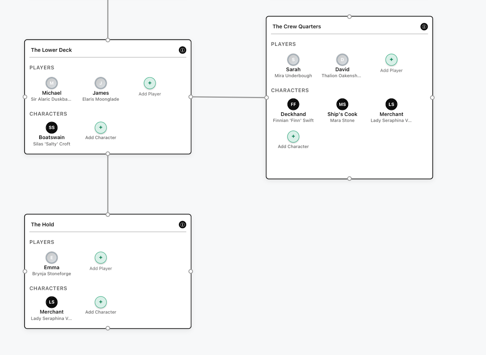
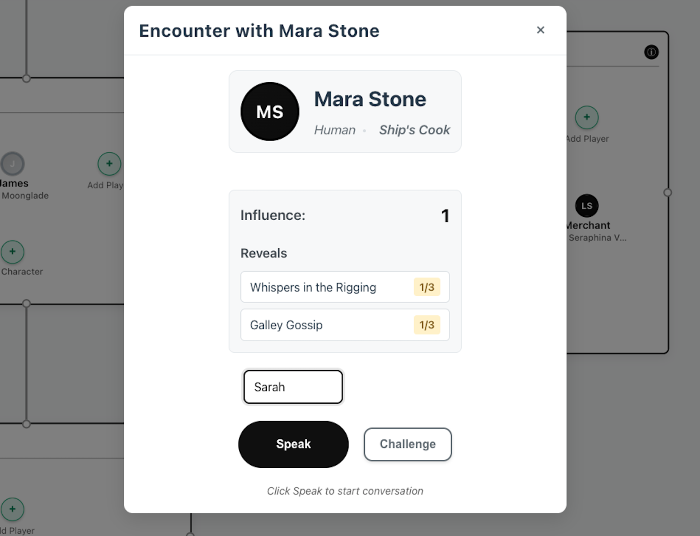
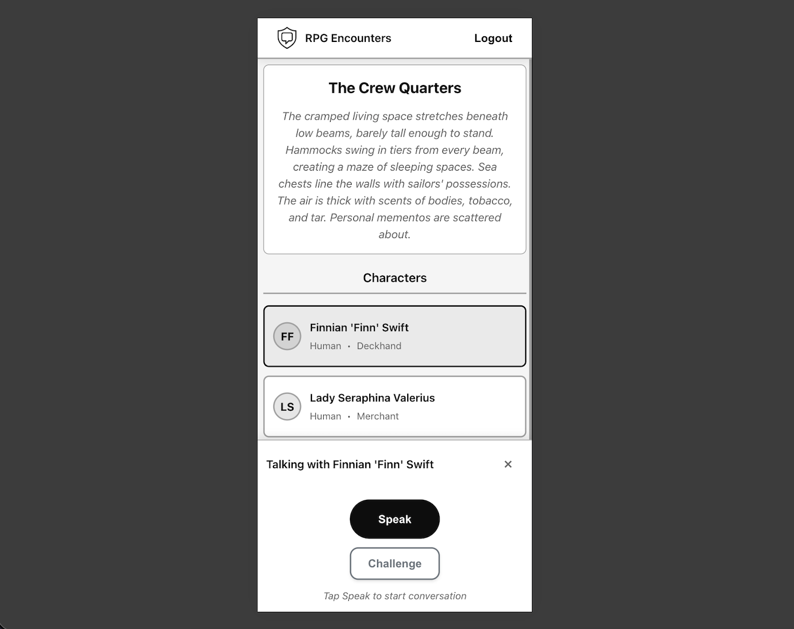
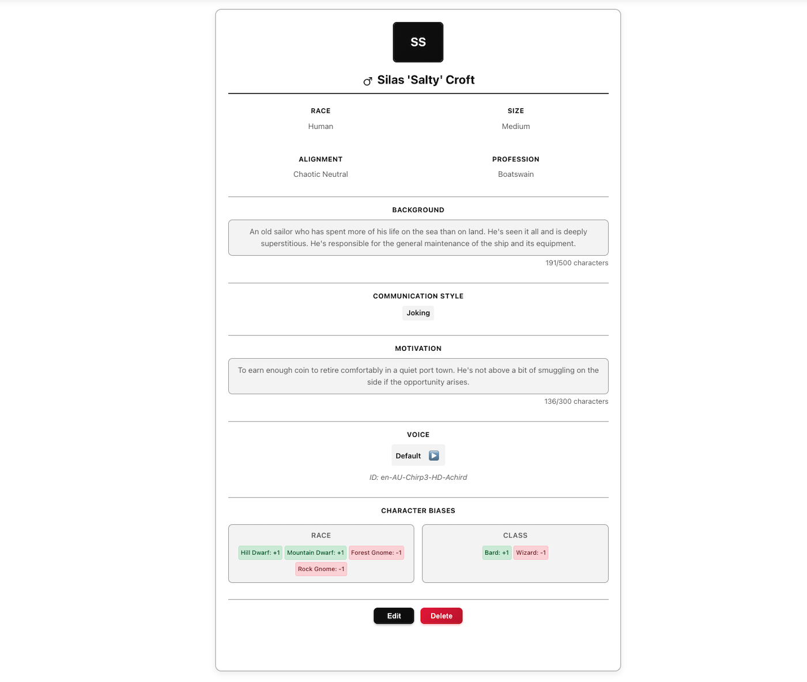

<p align="center">
    <a href="frontend/public/logo.png">
        
    </a>
</p>

<h2 align="center">
    <p>RPG Encounters</p>
</h2>

<div align="center">

[**Setup**](#-setup) | [**Getting started**](#-getting-started)

</div>

RPG encounter's goal is to use AI characters to create interactions that are entertaining for the whole table. It's designed for **in-person sessions**, where the Dungeon Master (DM) - **you** - controls to what extent the players engage with these characters.

It's designed to replace encounters where the DM does not want to impersonate characters and instead introduce some variability, and free-form role play, in a non-obtrusive way. You can choose to only setup one important character with plot hooks or important items, and keep all other interactions in-person. Or fill your scenarios with as many characters as you want.

## 🚀 Getting Started

1. Read the [game instructions](./frontend/public/instructions.md) and [features](#-core-features) to understand the mechanics.
2. Follow the [setup guide](#-setup) and [usage instructions](#-usage) or use the [hosted version](https://rpg-encounters.com).
3. Talk to some characters in the [default scenario](./frontend/public/instructions.md#the-captains-secret-crate)!

## ✨ Core Features

| | |
|---|---|
|  | **Visually manage encounters**<br/>Assign characters and players to encounters that match the board in front of you. |
|  | **Secrets that are unlocked with influence or ability checks**<br/>Players can choose to free-form role play to gain influence or challenge characters with a charisma based ability check. |
|  | **Players can speak through their phone**<br/>Generate login links for players and let them control the conversation. |
|  | **Characters with personality**<br/>Create characters with biases, motivations and trust based secrets, which dictate how they respond. |

## 👨‍💻 Demos

### DM Experience Demo

<video src="https://rpg-encounters.com/videos/dm-centric-demo.mp4"></video>

### Player Experience Demo

<video src="https://rpg-encounters.com/videos/player-centric-demo.mp4"></video>

## 🔌 Setup

- Follow `backend` [setup guide](./backend/README.md)
- Follow `frontend` [setup guide](./frontend/README.md)

## 💻 Usage

Launch frontend

```bash
npm run dev
```

Launch backend services

```bash
docker compose -f backend/docker-compose.yml -f backend/docker-compose.dev.yml up
```

### Microphone

You must decide how you want players to interact with characters. Locally, you are restricted to the shared microphone option unless you setup a [local LAN configuration](#local-lan). In the hosted version, you can choose between:

   1. **🎤 Shared Mic** - DM Controlled - Something that you can pass around or conference speaker works best. This allows the table to share in the experience. The DM initiates and stops dialogue from the `/encounters` screen.
   2. **📱 Mobile Phone** - Player Controlled - You can generate player login codes from the `/players` screen, such that players can use their mobile devices as their microphones.

### Login

Because the application uses magic links in production, locally you need to:

- Set `LOG_MAGIC_LINK=true` in `backend/.env`
- [Seed the database](./backend/README.md) with a user and email
- Request login link
- Copy login link from backend service logs, which looks something like: `test1@example.com login link: http://localhost:3001/auth?token=e-e6Cs6paxa6H0fmC0gYfrwfLElxWwkeSF0Jb6ck-XY`
- Paste login link into the same browser used to request it

### Avoiding Token Checks

You can avoid token billing checks by either:

- Setting `BILLING_IGNORE_BALANCE_CHECK=true` in `backend/.env`.
- Adjusting token balances with the script in `backend/tests/scripts/set_billing_state.py`:

```python
docker exec rpg-encounters-backend /app/.venv/bin/python tests/scripts/set_billing_state.py --email test1@example.com --available 1000000 --last-used 0
```

### Avoiding Moderation

You can skip moderation by setting `SKIP_MODERATION=true` in `backend/.env`.

### Changing Models

You can switch models by setting the appropriate API keys in your `backend/.env` and adjusting `src/core/backend/app/agents/base_agent.py` following the [Pydantic docs](https://ai.pydantic.dev/models/overview/).

### Changing TTS Provider

Provider availability is based on which API keys are set in `backend/.env`:

- ElevenLabs `ELEVENLABS_TTS_API_KEY`
- Google `GOOGLE_CLOUD_TTS_API_KEY`

The default provider is set by `DEFAULT_TTS_PROVIDER`.

### Local LAN

If you want players to speak through their own devices locally, you need to setup the LAN configuration.

**WARNING**: This only works if each player uses Chrome desktop. Mobile browsers block microphones on insecure origins.

1. Get IP address `ipconfig getifaddr en0`
2. Set `LAN_PUBLIC_URL` in `backend/.env` like `http://<IP_ADDRESS>:3001`
3. Set `VITE_BACKEND_URL` in `frontend/.env` like `http://<IP_ADDRESS>:8000/api`
4. Set `VITE_WEBSOCKET_URL` in `frontend/.env` like `ws://<IP_ADDRESS>:8000`
5. Launch backend and frontend services
6. Login and generate player links from the `/players` screen. Automatic copying to clipboard will fail because of restrictions to Clipboard API locally.
7. Each player launches Chrome with `open -n -a "Google Chrome" --args --unsafely-treat-insecure-origin-as-secure=http://<IP_ADDRESS>:3001`
8. Players login with the previously generated login link

## Support

There are many ways to support:

- Use it! Write about it! Star it!
- Sponsor my work at <https://www.buymeacoffee.com/carlrcr>

<a href="https://www.buymeacoffee.com/carlrcr" target="_blank"></a>
