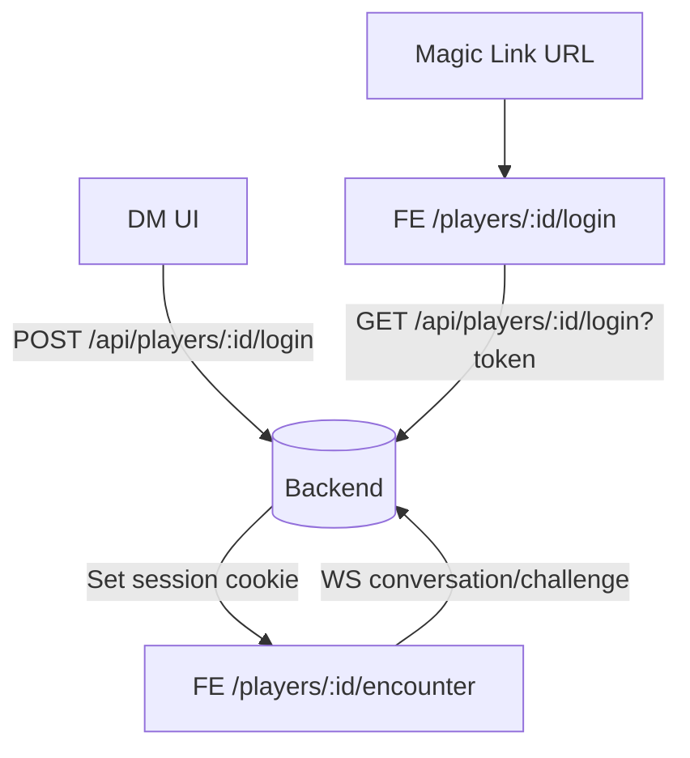

# Mobile Player Encounter View — Reuse-First Implementation Plan

Overview
- UI-only change. Back-end webhook/audio streaming behavior remains untouched.
- Reuse existing conversation and challenge WebSocket flows.
- New mobile-first player view shows a single encounter box with characters; players can: 
  - Tap a character to speak (record) and hear streamed audio playback.
  - Switch to Challenge, pick a skill, and see only the D20 roll result (and hear audio).
- DM tooling gets a per-player login link generator on the player card.

Scope and constraints
- No changes to webhook behavior, streaming formats, or back-end protocols.
- Reuse: media capture, WebSocket streaming, audio playback.
- Suppress DM-only data: influence, reveals, extra metadata are not shown in the player view.

Key backend facts to leverage
- Generate player login link: [players.request_player_login()](backend/app/routers/players.py:145) returns PlayerLoginResponse with fields [models.PlayerLoginResponse](backend/app/models/player_magic_link.py:34).
- Consume link and set session: [players.consume_player_login()](backend/app/routers/players.py:192) sets session and responds 301 to /players/{player_id}/encounter.
- Fetch the player’s encounter: [players.get_player_encounter()](backend/app/routers/players.py:241) guarded by validate_current_player.
- WebSockets (unchanged): [encounters.websocket_convo_endpoint()](backend/app/routers/encounters.py:292) and [encounters.websocket_challenge_endpoint()](backend/app/routers/encounters.py:328).

Frontend architecture
Routes
- Add two routes in [router.index.js](frontend/src/router/index.js:1):
  - /players/:playerId/login → PlayerLoginConsumePage.vue
  - /players/:playerId/encounter → PlayerEncounterView.vue

Player login consumption flow
- Player opens the magic link at FRONTEND_URL/players/:playerId/login?token=…
- PlayerLoginConsumePage:
  - Reads playerId param and token query.
  - Performs a credentialed GET to `${VITE_BACKEND_URL}/players/${playerId}/login?token=…` using window.location.replace for a top-level navigation OR a credentialed fetch to set the session cookie, then SPA-navigates to /players/:playerId/encounter.
  - Recommended: use fetch with credentials: 'include' to set session cookie without leaving the SPA, then router.push to /players/:playerId/encounter, mirroring [views/AuthCallbackPage.vue](frontend/src/views/AuthCallbackPage.vue:25).

DM player card — login link UI
- Update [components/PlayerCard.vue](frontend/src/components/PlayerCard.vue:1) detail view to add a bottom row:
  - Read-only input showing the current login_url.
  - Refresh button 🔄 that calls POST /api/players/:id/login via new api.createPlayerLoginLink and updates the input.
  - Copy button 📋 to copy the URL to clipboard with feedback.
- API shape: backend returns { login_url, expires_at }.

Player encounter view (mobile-first)
- New [views/PlayerEncounterView.vue](frontend/src/views/PlayerEncounterView.vue:1) renders:
  - A single encounter card (players can be in only one encounter).
  - Character grid reusing visual language from [components/EncounterNode.vue](frontend/src/components/EncounterNode.vue:1), stripped of DM-only affordances (no edit, no add/remove, no description).
  - On character tap/open: show only:
    - Speak button (toggles MediaRecorder) and streaming audio playback.
    - Challenge toggle with skills dropdown (from [stores/gameData.js](frontend/src/stores/gameData.js:1)) and a minimal readout: D20: N.
    - Do not render influence or reveals, do not cache them locally.

Streaming and audio reuse
- Playback: [composables/audio/WebSocketStreamPlayer.js](frontend/src/composables/audio/WebSocketStreamPlayer.js:4).
- Recording: reuse the MediaRecorder slice and permission flow from [components/CharacterEncounterPopup.vue](frontend/src/components/CharacterEncounterPopup.vue:446).
- WebSocket URLs (same as DM), optionally tag with player_init=true for telemetry only:
  - Conversation: `${VITE_WEBSOCKET_URL}/api/encounters/{encounterId}/conversation/{playerId}/{characterId}?world_id={worldId}&player_init=true`
  - Challenge: `${VITE_WEBSOCKET_URL}/api/encounters/{encounterId}/challenge/{playerId}/{characterId}?skill={selectedSkill}&d20_roll={diceRoll}&world_id={worldId}&player_init=true`
- End-of-stream control tokens handled as in [components/CharacterEncounterPopup.vue](frontend/src/components/CharacterEncounterPopup.vue:332).

Data loading
- Add api.getPlayerEncounter in [services/api.js](frontend/src/services/api.js:1): GET /players/:playerId/encounter.
- On PlayerEncounterView mount:
  - Load world and game data if needed.
  - Call getPlayerEncounter(playerId) to render the single encounter’s characters.
  - If 404, show 'No active encounter' minimal state.

New/changed frontend APIs
- [services/api.js](frontend/src/services/api.js:1):
  - createPlayerLoginLink(playerId): POST /players/:playerId/login → { login_url, expires_at }
  - getPlayerEncounter(playerId): GET /players/:playerId/encounter → Encounter

Components and files to create/update
- Create: [views/PlayerLoginConsumePage.vue](frontend/src/views/PlayerLoginConsumePage.vue:1)
- Create: [views/PlayerEncounterView.vue](frontend/src/views/PlayerEncounterView.vue:1)
- Update: [router.index.js](frontend/src/router/index.js:1)
- Update: [services/api.js](frontend/src/services/api.js:1)
- Update: [components/PlayerCard.vue](frontend/src/components/PlayerCard.vue:1)
- Optional small shared subcomponents:
  - CharacterTile (player-safe) extracted from [components/EncounterNode.vue](frontend/src/components/EncounterNode.vue:189).
  - AudioOnlyControls to wrap WebSocketStreamPlayer + MediaRecorder, reusing logic from [components/CharacterEncounterPopup.vue](frontend/src/components/CharacterEncounterPopup.vue:494).

Mobile UI guidelines
- Touch-first: large buttons, generous spacing; safe areas respected.
- Sticky bottom controls bar for Speak/Stop and Challenge actions.
- Single-column layout with scroll; avatars and labels sized for ~44–48px tap targets.
- Use shared design tokens: [styles/tokens.css](frontend/src/styles/tokens.css:1), [components/shared.css](frontend/src/components/shared.css:1).

Non-goals
- No changes to webhook schema, timing, or audio formats.
- No changes to agent logic or DM encounter UI.
- No reveal/influence surfaces in player view; do not cache conversation data there.

Mermaid: high-level flow

Acceptance criteria
- DM can generate and copy a player login link from [PlayerCard.vue](frontend/src/components/PlayerCard.vue:1).
- Opening the link on mobile logs in the player and lands on /players/:playerId/encounter within the SPA.
- The player encounter screen:
  - Lists characters for the single encounter.
  - Conversation: Speak/Stop works; audio streams and plays; no extra metadata is visible.
  - Challenge: shows a skills dropdown; after submit, displays only D20: N and plays audio; no reveals/influence shown.
- No regressions in DM encounter and canvas flows.
- Works on iOS Safari and Android Chrome; autoplay constraints handled by prepare/unlock in WebSocketStreamPlayer.

QA checklist
- Generate multiple links; verify newest works; expired/used tokens are rejected by backend.
- Microphone permission prompt appears once; errors are surfaced if denied.
- Progressive audio plays during streaming chunks; END control finalizes playback.
- Mobile viewport sanity on 360×640 and 390×844.
- Verify CORS and cookies: session persists across reloads; API calls include credentials.

Rollout
- Feature-flag optional by routing availability.
- Backward compatible; only additive frontend changes.
- Easy rollback: remove new routes/components; no backend changes required.